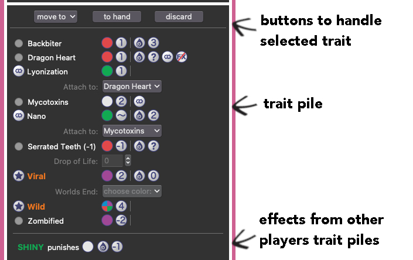
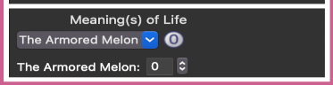

# DoomPy

>:: a python gui to keep track of scores _while_ playing [**Doomlings**](https://doomlings.com/)

[](https://github.com/azabicki/DoomPy "Go to GitHub repo")
[](https://python.org "Go to Python homepage")
[](https://github.com/azabicki/DoomPy/blob/main/LICENSE)
[](https://github.com/azabicki/DoomPy)
[](https://github.com/azabicki/DoomPy)
[](https://github.com/azabicki/DoomPy/issues)

## Introduction

### _Doomlings_
Ever since friends backed the original version on Kickstarter and the game finally arrived, we've been more than just addicted to [**Doomlings**](https://doomlings.com/) from the very first second. Unfortunately, we don't live too close to one another, so we only see each other every few weeks/months. But WHEN we do, it's set in stone that at least (!) one [**Doomlings**](https://doomlings.com/) session has to be played!

I guess anyone who knows the game knows how much you can annoy each other by stealing or swapping yet another trait from the trait pile. And sometimes you don't even want to, especially not to jeopardise the peace that has just been restored. But if it has to be done, we thought it would only be fair if the player in the lead becomes the target. 

So we always tried to get a quick overview of the others' points. But with all the scoring rules, it's quite difficult to work out who's in the lead. Especially as we extended it to 4 catastrophes at some point.

### _+ Python_

After many years of MATLAB and several unsuccessful attempts to switch to Python, I finally started using Python at the end of 2023 and turned my back on MATLAB for good. And what's the best way to learn a programming language? Exactly: With an interesting project! 

### _= DoomPy_

So it was only natural for my first python project to be a [**Doomlings**](https://doomlings.com/) live points counter. Consequently,

"**Doom**lings" + "**Py**thon" = "**DoomPy**" 

was born. With **DoomPy** you can easily allocate the traits to the respective players trait piles, select catastrophes & MOLs, and thus see what the score looks like at any time.

## Methods

If you take a look at my code, please keep in mind that I'm new to Python and forgive the, very likely little _Pythonic_, chaos.

In the past I've been coding mostly in academia, especially with MATLAB. Therefore my coding style is very procedural. I have never coded in an object-orientated way. So I'm sure that there would be a much more efficient OOP alternative, especially in this case where players/traits/MOLs/ages are predestined to be defined as a `class`... but that might be a project for the future when I learn OOP.

### How to run it

As this is also the first time that I am sharing a Python project with the world, this also poses new challenges for me. 
I think (hope) it should be possible for anyone with the provided [requirements.txt](./requirements.txt) to set up a virtual environment in which DoomPy has to run.

#### 1. getting the repo

[Download the repository][zip] and unzip it. Or if you prefer to use the terminal, run

```terminal
wget https://github.com/azabicki/DoomPy/archive/refs/heads/main.zip
```

or 

```terminal
curl -L -O https://github.com/azabicki/DoomPy/archive/refs/heads/main.zip
```

(see [comment](https://askubuntu.com/questions/939830/how-to-download-a-github-repo-as-zip-using-command-line/1236771#comment2125069_1236771) on curl)

#### 2. virtual environmant

Install the virtual environment with the tool of your choice. You find a `requirements.txt` in the repo base folder

#### 3. go play

Finally, run 

```terminal
python /path/to/DoomPy/main.py
```

and have fun playing Doomlings!!

### further requirements

_Display Resolution_: This is a very important aspect, since the GUI takes a lot of space. Especially if you play with 4 catastrophes and many rounds. And depending on which traits are played, it may happen that the height of the trait pile is larger than the screen, making it impossible to select MOLs. With 4 players and 4 catastrophes and on a `1800 x 1200` display, we ocasionally run into problems.

Hence, if possible:

 - use a higher **vertical** resolution as 1200 px if played with more than 3 catastrophes 
 - use a wider **horizontal** resolution as 1800 px if you play with more then 4 players. 

## Results

Depending on your OS Dark-Mode, DoomPy looks like this:


The GUI consist of mainly two parts:

- The **Control** box on the left, where you
  - set some options for the next game
  - deal traits from the deck to the players trait piles
  - select catastrophes world's end events
  - turn some options for the current on and off  
- and **Trait Pile**s on the right, where you 
  - see the player's current score
  - organize each player's trait pile (i.e. playing, attaching, swapping and discarding traits)
  - select MOL(s)

### Overview

I hope that the handling is self-explanatory. Especially if you've already played a round or two of [**Doomlings**](https://doomlings.com/). But just in case, you can find more detailed explanations here.


### How to: Controls

- **Game Options:**
  - Set the amount of players, size of gene pool, amount of catastrophes & MOLs.
  - Name the players, but keep the correct order at the table, because some effects affects the players to your left or right.
  - The radiobutton to the right of the names defines the _first player_ (name is green). It can be changed at any time during the game, and changes automatically after each catastrophe.
  - Click on `start game` to clear the table and restart the game.
- **Deck:**
  - `Search` for the name of a `Trait`. As soon as there is only one possibility left, the cursor jumps automatically into the list.
    - Click on <kbd>clr</kbd> to clear the search field.
    - You may also just use the <kbd>down-arrow</kbd> key or the mouse to select a trait.
  - Click on the `player`-button to deal the selected trait into his/her trait pile.
  - Please note: If you play `Heroic`, a pop-up will be shown & asking if `Heroic` is played during the `Birth of a Hero` age (to bypass the 2-dominant restrictions).
  - There are _ambiguous traits_ in the deck! In these cases additions to the names should resolve any uncertainties:
    - `{A}`: trait has an _action_
    - `(~)`: face value is _variable_
    - `(2)`: numbers in parenthesis show the _face value_
    - `(WE)`: trait has a _world's end effect_
    - `(b)`, `(g)`, `(p)`, `(r)` or `(c)`: color of trait is _blue_, _green_, _purple_, _red_ or _colorless_
- **Catastrophes & World's End:**
  - Every time a catastrophe is turned, select it from the dropdown box.
    - _First player_ is automatically changed.
  - Since `Prepper` is able to choose the `World's End` effect, you may need to change it manually.
  - As soon as every _trait's world's end effects_ are resolved, click on th `GO!` button to activate the actual `World's E` effect.
- **Settings:**
  - As a joke, we thought it could be funny to record our own little `Sound-Bites` of all the "_quotes_" on top of every trait. But until now, we only added some generic mp3's. Turn it on and be surprised :smile: (or annoyed :roll_eyes:)
    -  `Music Off`
    -  `Music On`
  - You can change which `Trait Property` icons will be shown in the trait pile:
    -  `Default`:  basic properties about the trait + effects
    -  `None`: only effects
    -  `Full`: all properties (needs a wide screen!)
  - Select 'Scoring Mode', i.e. how the current scores are shown:
    -  `Points`: show all the points
    -  `Rank`: show only the rank of the players
    -  `Hidden`: do not show any points

### How to: Scoreboard


The `Scoreboard` shows for each player all the relevant information.

- **Dominants:**
  - Stars -  - indicate how many `Dominant Traits` are in the trait pile
- **Name:**
  - Is <font color="green">**green**</font> if player is the current _first player_
- **Gene Pool:**
  - Shows current `Gene Pool` of the player
- **# of Colors:**
  - displays the current `Color Count`, as well as the complete trait count in the trait pile
- **Total Points:**
  - Depending on `Settings`, you will see either the _Total Score_, the players current _Rank_, or a _Star-Symbol_ hiding the current score.
- **Points by Category:**
  -  = `Face Value`
  -  = `Drop Points`, as far as possible to be calculated automatically
  -  = `World's End Points`, as far as possible to be calculated automatically
  -  = `MOL Points`, as far as possible to be calculated automatically

### How to: Trait Pile



Here is an example of a trait pile, showing many (hopefully almost all) possible situations that may happen:

#### Handling of Traits

- First, select any trait by the `Radiobutton` on the left (with exception of dominant traits and attachments).
- Then, decide if you wnat to `move` this trait to another players trait pile, put it back `to the hand`, or `discard` it.

#### The actual Trait Pile
- **Each Trait:**
  - Has an icon depicting its `Color` and `Face Value`.
    - See `Wild` for a multi-color example.
  - A vertical line separates these properties from any effects.
- **Drop Effects:**
  - If a trait has a drop effect, it is indicated by a `Drop` and a `Value` icon.
    - See `Backbiter` for an example: its drop effect is worth 3 points, since `Zombified` is in the trait pile.
  - If drop effects are based on the `player's hand` or the `discard pile`, they cannot be calculated automatically and need to be set manually.
  - This is only possible once `World's End` has been played
    - See `Serrated Teeth` as an example.
- **Attachments:**
  - Are indicated by an `Attachment` icon instead of the radiobutton on the left side (it cannot be discarded by its own).
  - Select the `Host` in the drop-down menu, which is then also marked by an `Attachment` icon.
    - Ex. 1: `Lyonization` on `Dragon Heart` -> `Dragon Heart`s drop effect is now inactive, which is shown by the `Question Mark` and the `Effects inactive` icons
    - Ex. 2: `Nano` on `Mycotoxins` -> `Nano` has a drop effect, which is now worth as much as the `Host`s face value
- **Dominant Traits:**
  - Are indicated by a `Dominant` icon instead of the radiobutton on the left side (it cannot be discarded by its own), and a different font style.
- **World's End Effects:**
  - If a trait has a `World's End` effect which needs to be set by the player, a drop-down menu is shown.
  - This is only possible after the last `Catastrophe` happened.
    - See `Viral` for an example

#### Effects from other Trait Piles

- If you are affected by another player's traits, these effects are listed under your own trait pile.
  - See `Shiny` as an example.

### How to: MOLs



- Simply select the desired MOL at any time.
- This way it is possible to play with a common MOL and having it evaluated immediately.
- If a MOLs points cannot be calculated automatically, an entry field appears where the MOLs points can be set.

### World's End

At the end of the game, certain steps need to be done in a order which is pretty much the same as the actual ones you perfom IRL.

1. Once the last `Catastrophe` is played, you are able to select the traits world's end effect.
   - E.g. for `Viral` in the trait pile above.
2. And once every traits world's end effect is selected, the <kbd>GO!</kbd> button becomes enabled and you can go and trigger the `World's End` effect of the selected `Catastrophe`.
   - Note: Eventually you need to enter the world's end point manually.
3. Then, you need to manually update `Drop` counts if certain traits are played.
   - E.g. for `Serrated Teeth` in the example above.
4. Maybe someone has `Neoteny` ? 
5. Finally, select each players `MOL`s.

_And that's it. Have fun using it!_

---
> [!IMPORTANT] 
> Discard **Dominants** and **Attachments**!

Of course, there is a little back-door for you to remove dominant traits and attachment from your trait pile, in case you played them by mistake. Just click on the `vertical line`separating the traits basic properties from effects.

> [!TIP] 
> Use **keyboard** shortcuts!

I tried to design the handling of **DoomPy** as smooth as possible. For the major time of the game you do not need to use the mouse or trackpad, dealing trait into the different trait piles, changing focus to specific catastrophes, of bringing focus back to the seach field, you can use **keyboard shortcuts** for every one of these actions:

- as soon as a trait is selected in the deck:
  - key <kbd>1</kbd> to deal it to player #1
  - key <kbd>2</kbd> to deal it to player #2
  - key <kbd>3</kbd> to deal it to player #3
  - ... and so on
- switch to catastrophes:
  - key <kbd>F1</kbd> to catastrophe #1
  - key <kbd>F2</kbd> to catastrophe #2
  - ... and so on
- key <kbd>F7</kbd> to quickly jump into search entry

> [!TIP]
> **Customise** the Deck!

You can customize which traits are in the deck by editing the `./doompy/files/cards.xlsx` file. Just change the `in_game` column to `no` to remove the trait from the deck, or edit the `n_cards` columns to change the amount of traits in the deck.

> [!TIP]
> Make your **OWN** sounds!

If you like the Music function, you can just record your own sound bites and add the to the `doompy/sounds/` folder. It only has to be named like the corresponding trait, and it should be recognized & played by the script. 

## Discussion

### Bugs Found?

I have tested DoomPy quite intensively and we have also used it in several real games, which has also brought some bugs to light. Nevertheless, it is of course possible that some bugs have slipped through. If you find a bug, just open an [issue](https://github.com/azabicki/DoomPy/issues)! I will take care of it as soon as possible!

### Ideas? 

Do you have any suggestions for improvement? Have I forgotten to add a trait? Or any other ideas or criticism? Just create an [issue](https://github.com/azabicki/DoomPy/issues) and I'll get back to you :)


[zip]: https://github.com/azabicki/DoomPy/archive/refs/heads/main.zip
